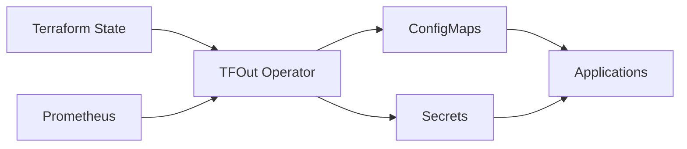

# tfout

[](https://opensource.org/licenses/MIT)
[](https://goreportcard.com/report/github.com/swibrow/tfout)

tfout is a Kubernetes operator that automatically syncs Terraform outputs from various backends into ConfigMaps and Secrets. It helps bridge the gap between your Terraform infrastructure and Kubernetes applications by making Terraform outputs easily accessible within your cluster.

## Features

- **Multiple Backend Support**: Currently supports S3, with planned support for GCS, Azure, and HTTP backends
- **Automatic Sync**: Continuously monitors Terraform state files and updates Kubernetes resources
- **Smart Resource Management**: Automatically separates sensitive and non-sensitive outputs into Secrets and ConfigMaps
- **Change Detection**: Uses ETags and checksums to minimize unnecessary API calls
- **Comprehensive Metrics**: Built-in Prometheus metrics for monitoring and alerting
- **High Availability**: Supports leader election for multi-replica deployments
- **Helm Chart**: Easy deployment with customizable Helm chart

## Architecture



TFOut watches `TerraformOutputs` custom resources and:

1. Fetches Terraform state files from configured backends
2. Extracts outputs and determines sensitivity
3. Creates/updates ConfigMaps for non-sensitive outputs
4. Creates/updates Secrets for sensitive outputs
5. Provides detailed status and metrics

## Quick Example

```yaml
apiVersion: tfout.wibrow.net/v1alpha1
kind: TerraformOutputs
metadata:
  name: my-infrastructure
spec:
  syncInterval: 5m
  backends:
  - s3:
      bucket: my-terraform-state
      key: infrastructure/terraform.tfstate
      region: us-west-2
  target:
    namespace: production
    configMapName: infrastructure-config
    secretName: infrastructure-secrets
```

## Getting Started

1. [Install tfout](installation.md) in your cluster
2. Follow the [Quick Start](quick-start.md) guide
3. Explore [Examples](examples/basic.md) for common use cases

## Use Cases

- **Application Configuration**: Expose database endpoints, API URLs, and other infrastructure details to applications
- **Secret Management**: Safely distribute sensitive outputs like passwords and API keys
- **Multi-Environment**: Sync different Terraform workspaces to different namespaces
- **GitOps Integration**: Automatically update application configs when infrastructure changes

## Community

- [GitHub Repository](https://github.com/swibrow/tfout)
- [Issues](https://github.com/swibrow/tfout/issues)
- [Discussions](https://github.com/swibrow/tfout/discussions)